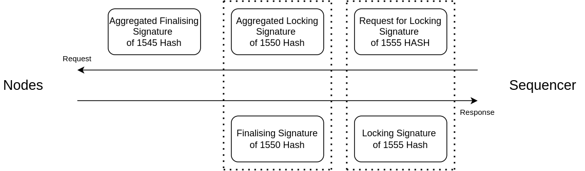

The Protocol
============

Posting
-------

* **Receiving Transactions:** A node receives user transactions and sets their state to *initialised*.

* **Posting to Sequencer:** The node sends its *initialised* transactions to the Sequencer and receives a list of sequenced transactions, including its own and others', each with an index. The node updates its transactions with these indices and changes their state to *sequenced*.

* **Tracking Last Index:** Each node includes the index of the last received transaction from the Sequencer in their posts to ensure they receive only newly sequenced transactions.

* **Regular Posting:** Nodes must regularly post requests to the Sequencer, even without new transactions, to stay updated on transactions from other nodes.

Finalising
----------

* **Calculate Chaining Hash:** For each transaction with index ``n``, the node computes the chaining hash as h\ :sub:`n` = hash( h\ :sub:`n-1` + hash(tx\ :sub:`n` ) ) to ensure a consistent transaction order across all nodes.

* **Store Latest Index:** The sequencer keeps track of the latest index returned to each node after a post request.

* **Determine Syncing Point:** The sequencer periodically calculates the syncing point, the index reached by a threshold number of nodes, and requests a signature from them on the chaining hash of that index to indicate readiness to lock transactions.

* **Aggregate Locking Signatures:** Upon receiving locking signatures from the nodes, the sequencer aggregates them and sends the aggregated locking signature back to the nodes. Nodes verify and update the state of all transactions up to that index to *locked* and respond with a finalising signature.

* **Aggregate Finalising Signatures:** The sequencer aggregates the finalising signatures received from the nodes and sends the aggregated finalising signature back. Nodes then verify and update the state of all transactions up to that index to *finalised*.

* **Simultaneous Requests:** To enhance efficiency, the sequencer simultaneously requests locking signatures for a current index and finalising signatures for an older index (for which it has already received locking signatures) in each request.

Disputing
---------

* **Initiating a Dispute:** A node initiates a dispute against the Sequencer if:
  * The Sequencer fails to respond, indicating it may be offline.
  * The Sequencer excludes the node's transactions, suggesting censorship.
  * The Sequencer does not update the finalisation proof within a predefined period, implying possible inconsistency in transaction orders.

* **Sharing Evidence:** The node shares the problematic transactions with other nodes and collects their signatures to confirm the Sequencer's malfunction.

* **Triggering a Switch:** If the threshold number of nodes confirms the issue, the node sends the collected signatures to all nodes to initiate the switching process.

Switching
---------

* **Resetting Transactions:** Upon receiving a switch request, nodes reset all *sequenced* transactions to *initialised* and switch to the next Sequencer.

* **New Sequencer Sync:** The new Sequencer queries all nodes for their latest *locked* and *finalised* transactions and syncs with the node having the highest index before processing new requests.

